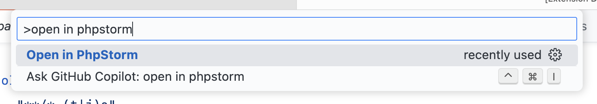
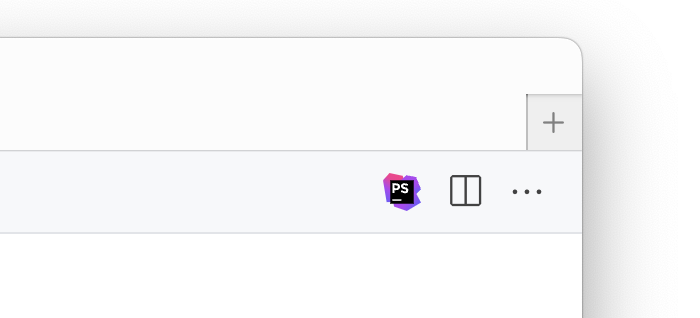
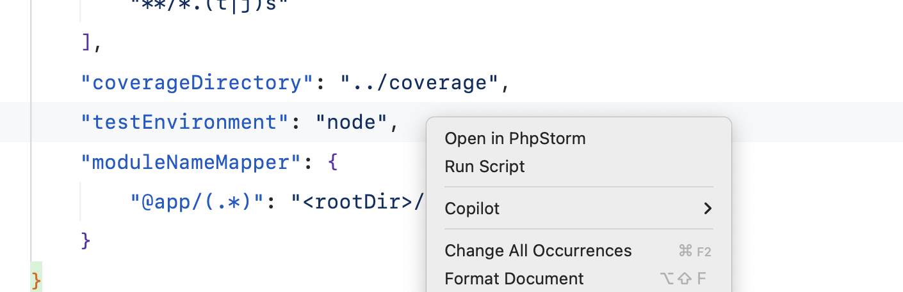

# Open in PhpStorm

A VS Code/Cursor extension that allows you to quickly open files and projects in PhpStorm directly from your editor.

## Features

- Open files and folders in PhpStorm with a single click
- Context menu integration in VS Code/Cursor's file explorer
- Command palette support
- Maintains your current workspace organization while leveraging PhpStorm's powerful features

## Screenshots

### Command palette

### Menu

### Context menu

## Requirements

- Visual Studio Code or Cursor
- PhpStorm installed on your system

## Installation

1. Install the extension from the VS Code Marketplace
2. Ensure PhpStorm is installed on your system
3. (Optional) Configure the extension settings if PhpStorm is installed in a non-standard location

## Usage

There are several ways to open files in PhpStorm:

1. Right-click on a file or folder in the VS Code/Cursor file explorer and select "Open in PhpStorm"
2. Use the command palette (Cmd/Ctrl + Shift + P) and search for "Open in PhpStorm"
3. Use the keyboard shortcut (configurable in VS Code settings)

## Contributing

Contributions are welcome! Please feel free to submit a Pull Request.

## Author

Maarten Bode
